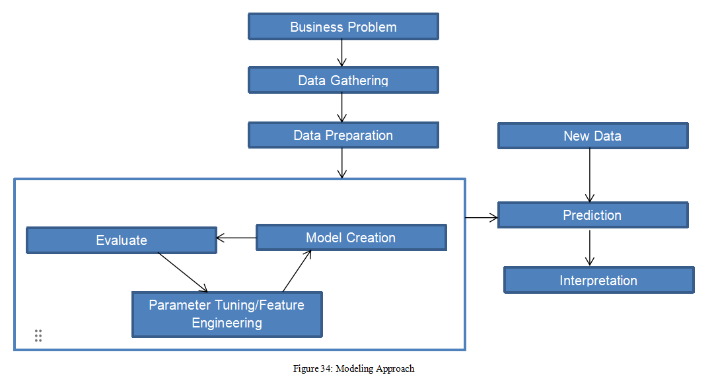

<h1 align="center"> :large_orange_diamond: Data Preparation :large_orange_diamond: </h1>

After gaining the insights from the EDA, actual model building can be started. Below flow chart shows the approach that can be performed in order to create any machine learning model.

** Business Problem:** The goal of our analysis is to predict that whether particular customer will subscribe to term deposit or not which will ultimately provide the insights related to success of the telemarketing campaign. Hence this is a classification problem and classification machine learning algorithms can be built to predict target class. 

** Data Gathering:** The entire dataset is divided into 70:30 split into Training and Testing datasets.

** Data-Preprocessing

   - Missing Values: The categorical columns like education, contact, Job, default, housing loan and poutcome have missing values denoted as ‘unknown’ which were replaced using mice library by sophisticated multiple imputation method.
   - Data Transformation: 

