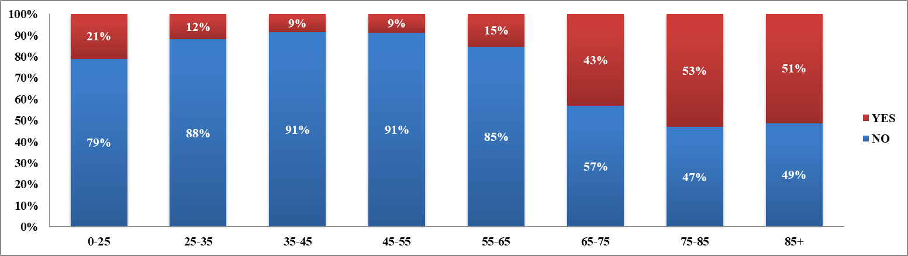
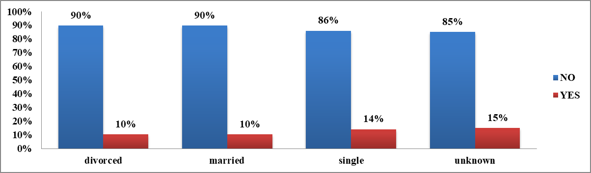
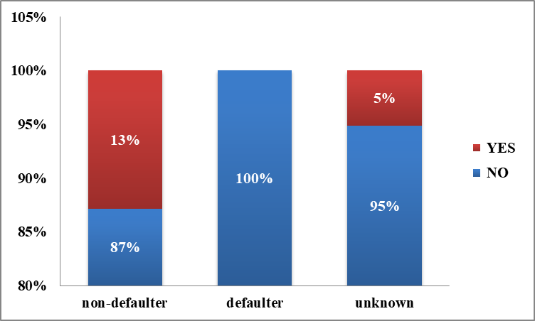
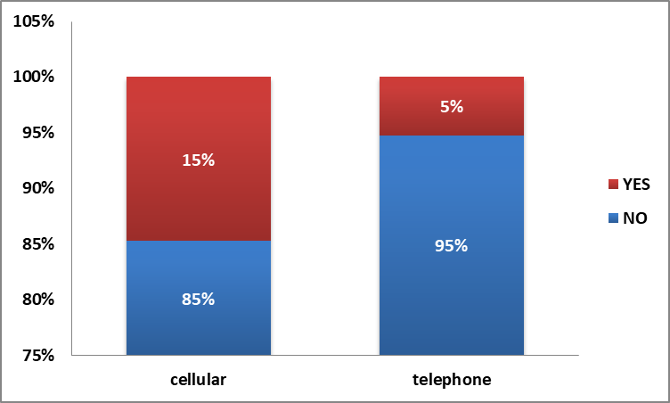
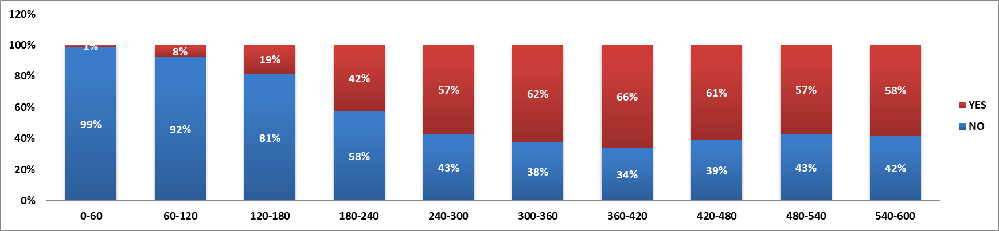
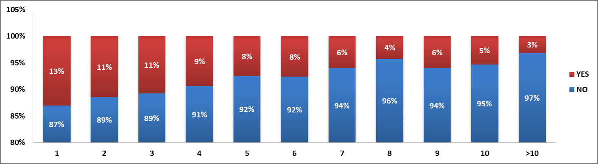
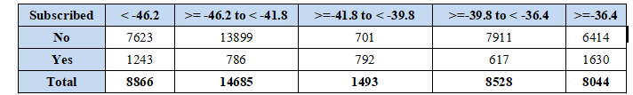
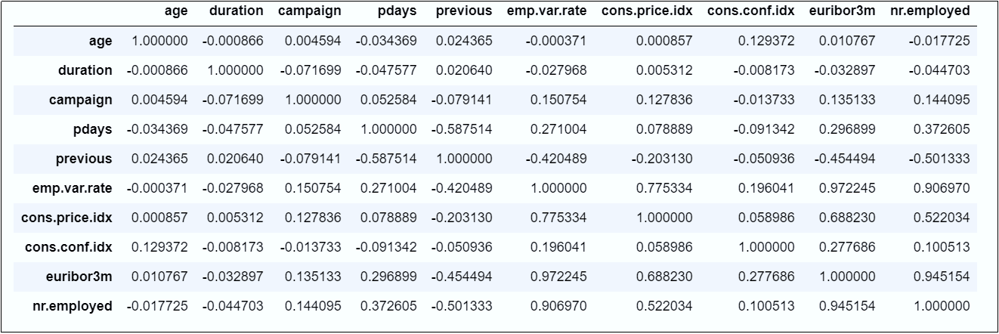

<h1 align="center"> :large_orange_diamond: Exploratory Data Analysis :large_orange_diamond: </h1>

### A. Target Variable Distribution

The target variable shows the subscription distribution across all customers. In the given data set, 11.27% of customers subscribed for term deposit.

### B.Features
**<ins>Age:</ins>**

- Age binned into 7 categories (0-25, 25-35, 35-45, 45-55, 55-65, 65-75, 75-85, 85+)
- Majority of customers fall in 25-45 age bracket 

**Interpretation** : Customers of age group 35-55 (working class) are likely not to subscribe to term deposit products.

**<ins>Job:</ins>**

25% of customers in job group “Retired” and 31% of the customers in “Student” category have responded positively for subscription and this observation lies in sync with our analysis of customers responses based on Age group. An interesting observation is 14% of “Unemployed” customers responded positively as well.

**Interpretation**: Customers with blue collar jobs are likely not to subscribe to term deposit products.

**<ins>Marital:</ins>**

Distribution- Married (60%), Single (28%), Divorced (12%)  
**Interpretation**: Overall Balanced representation of subscription within categories

**<ins>Default:</ins>**  

**Interpretation**: Customers with no defaults have higher subscription rates

**<ins>Contact:</ins>**  

**Interpretation**
   - **Critical Finding:** Cellular contact shows dramatically higher subscription rates (~18-20%)
   - **Telephone contact:** Much lower subscription rates (~5-8%)
**Recommendation:** Prioritize cellular contact channels

**<ins>Call Duration:</ins>**

 **Interpretation**  
    - **Strong Positive Correlation:** Longer calls significantly increase subscription probability
    - **180+ seconds:** > 30% subscription rate  
 **Insight:** Call quality and engagement crucial for conversion 

**<ins>Campaign Contact:</ins>**

**Interpretation**
   - 1-3 contacts show highest conversion
   - 5+ contacts show diminishing returns/negative impact
**Insight:** Optimal contact frequency exists

**<ins>Consumer Confidence:</ins>**  

Consumer confidence, measured by the Consumer Confidence Index (CCI), is defined as the degree of optimism about the state of the economy that consumers are expressing through their activities of saving and spending.  
**Interpretation**
  - Strong positive correlation: Higher confidence → higher subscriptions
  - Economic sentiment critical factor

## Correlation Matrix:

 

i.Age variable has positive correlation with Cons.conf.idx variable which means that older customers will show more confidence in economy which will lead to higher spending/saving.  
ii.Campaign variable has positive correlation with Emp.var.rate, Cons.conf.idx and Euribor3m variables which means that these three variables will impact positively on responses for the campaign.  
iii.Pdays variable has strong negative correlation with Previous variable whereas there is a positive correlation with Emp.var.rate, Nr.employee and Euribor3m variables.  
iv.Previous variable has strong negative correlation with Pdays, Emp.var.rate, Cons.conf.idx, Nr.employee and Euribor3m variables i.e. number of days that passed by after the client was last contacted from a previous campaign and socio-economic variables impacts outcome of how many times a customer is contacted and his/her response.  
v.5 socio-economic variables Emp.var.rate, Cons.price.idx, Cons.conf.idx, Euribor3m and Nr.employed are showing a correlation coefficient higher than 0.90 which is way too much. Our indicators are too correlated and share redundant information.  emp.var.rate isn’t meaningful. We’re removing it to soften correlations between those 5 variables. Also, there’s still a high correlation between two variables: euribor3m and nr.employed (0.94) but bank size (number of employees) isn’t reactive to euribor rate. This is probably a spurious correlation so we’re keeping all features.  

