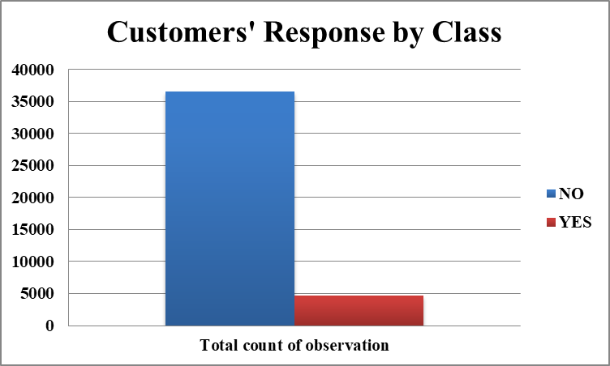
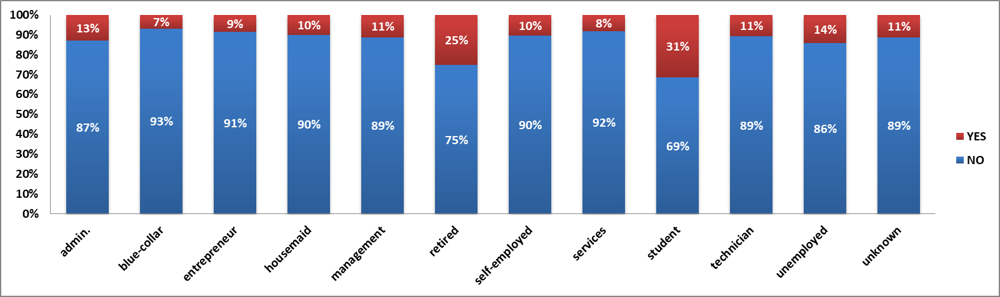

## Exploratory Data Analysis

#### A. Target Variable Distribution

The target variable shows the subscription distribution across all customers. In the given data set, 11.27% of customers subscribed for term deposit:

#### B. Demographic Features
**Age:**

- Age binned into 7 categories (0-25, 25-35, 35-45, 45-55, 55-65, 65-75, 75-85, 85+)
- Majority of customers fall in 25-45 age bracket 

**Interpretation** : Customers of age group 35-55 (working class) are likely not to subscribe to term deposit products.

**Job:**

25% of customers in job group “Retired” and 31% of the customers in “Student” category have responded positively for subscription and this observation lies in sync with our analysis of customers responses based on Age group. An interesting observation is 14% of “Unemployed” customers responded positively as well.

**Interpretation**: Customers with blue collar jobs are likely not to subscribe to term deposit products.

**Marital:**

